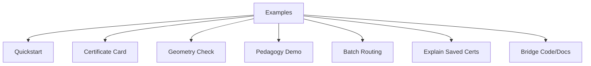

# Examples: Learning by Doing

> Quick-Scan Infobox  
> | Aspect | Details |  
> |--------|---------|  
> | Target User | Engineers verifying components, researchers examining decisions, educators adapting for lessons; basic Python and terminal use assumed. |  
> | Core Goal | Provide complete, runnable scripts that demonstrate routing, inspection, and adjustment, with outputs that reveal system reasoning. |  
> | Time to First Insight | 10 minutes: install, run one script, review the certificate. |  
> | Key Analogy | A set of prepared materials: each script invites direct use, shows immediate results, and supports repeated trials for clearer understanding. |  
> | Known Limitation | Scripts use synthetic or sample data; real prompts may need config tweaks for optimal signals. |

---

## The Prepared Environment

Effective learning starts with materials that are ready and self-correcting. These examples follow that approach: Each one runs independently, produces observable outputs, and includes checks for common issues. Use them to trace a route, inspect a decision, or test a concept, then adjust based on what the signals show.

This structure draws from established methods where feedback comes from the activity itself, allowing steady progress without external prompts.

---

## Installation: Setting Up Your Space

Set up a virtual environment to isolate dependencies.

Expected Output:
```
Successfully installed compitum-0.1.0 ... (list of packages)
```

On Windows (PowerShell): Replace `source .venv/bin/activate` with `.venv\Scripts\Activate.ps1`.

Verify: `compitum --version` should show the installed version, such as "0.1.0".

Limitation: Requires Python 3.9+; if pip fails, update with `pip install --upgrade pip`.

---

## Example Categories

Examples Overview


Caption: Example categories with a single index node. Alt text: Nodes for Quickstart, Card, Geometry, Pedagogy, Batch, Explain, Bridge.

---

## Examples Tour Notebook (optional)

<!-- NOTEBOOK:examples_tour:BEGIN -->
Rendered notebook will be embedded by CI.
<!-- NOTEBOOK:examples_tour:END -->

---

### Quickstart: Your First Route

<!-- NOTEBOOK:examples_demo_route:BEGIN -->
Rendered notebook will be embedded by CI.
<!-- NOTEBOOK:examples_demo_route:END -->

Script: `examples/demo_route.py`  
Time: 30 seconds  
Concept: Full routing process, from prompt to certificate.

Run this to process a prompt and view the decision.

Expected Output:
```
Selected: thinking (utility=0.82)
```

This output provides direct feedback: check slack values for feasibility, shadow prices for constraint impacts, and entropy for decision confidence. If entropy is low (<1.0), the choice was narrow; consider relaxing bounds.

#### Interpreting the Output (Quickstart)
- Utility: values around 0.7-0.9 typically indicate a confident choice; <0.6 suggests constraints are tight or the prompt is off-manifold.
- Boundary gap: >0.15 indicates clear separation between models; <0.05 suggests ambiguity.
- Shadow prices: near 0 means constraints are not binding; >0.5 means the constraint is limiting utility.
- Drift signal: negative and small magnitude indicates stability across iterations.
- Investigate when: low utility despite feasibility; multiple high shadow prices; ambiguous boundary.

---

### Certificate Cards: Human-Readable Summaries

<!-- NOTEBOOK:examples_certificate_card:BEGIN -->
Rendered notebook will be embedded by CI.
<!-- NOTEBOOK:examples_certificate_card:END -->

Script: `examples/certificate_card.py`  
Time: 1 minute  
Concept: Format certificate details for quick review.

Expected Output (example):
```markdown
# Certificate Summary
- Model: thinking
- Utility: 0.8234
- Components:
  - quality: +0.65
  - coherence: +0.12
  - diversity: +0.92
- Boundary: gap=0.15 entropy=1.42 (confident)
- Feasible: True
- Shadow prices: latency=0.08 cost=0.12 (low impact)
- Trust radius: 1.2
```

This view highlights key signals: positive coherence shows alignment with prior traces; low shadow prices indicate room for adjustments. Use it to discuss decisions without parsing JSON.

Limitation: Assumes a single certificate; for batches, chain with batch scripts.

#### Interpreting the Output (Certificate Card)
- Utility magnitude: 0.5-0.9 is typical; sustained <0.6 suggests either tight bounds or metric miscalibration.
- Boundary gap and entropy: gap>0.15 with moderate entropy implies a clear decision; small gap with high entropy implies uncertainty.
- Shadow prices: focus on the largest components; values >0.5 identify the strongest bottlenecks.
- When to dig deeper: ambiguous boundary, multiple high shadow prices, or low utility with feasibility.

---

### Geometry Sanity Check: Does Distance Mean Anything?

<!-- NOTEBOOK:examples_synth_bench:BEGIN -->
Rendered notebook will be embedded by CI.
<!-- NOTEBOOK:examples_synth_bench:END -->

Script: `examples/synth_bench.py`  
Time: 2 minutes  
Concept: Test if the SPD metric distinguishes prompt types.

Expected Output: differences >0.5 suggest separation; rerun with `--seed 42` for consistency.

This measures average distances in synthetic clusters (math vs. code prompts). If gaps are small, the metric may need retraining; check rank parameter.

#### Interpreting the Output (Geometry)
- Mean distances: larger separation between clusters (e.g., >0.5) indicates the SPD metric distinguishes prompt families.
- Sensitivity: if separation is small, adjust metric rank or retrain; fix seeds for reproducibility when comparing runs.
- Expect minor variance run-to-run; large swings suggest insufficient samples.

---

### Pedagogy Demo: Practice Improves Evidence

<!-- NOTEBOOK:examples_pedagogy_control_of_error:BEGIN -->
Rendered notebook will be embedded by CI.
<!-- NOTEBOOK:examples_pedagogy_control_of_error:END -->

Script: `examples/pedagogy_control_of_error.py`  
Time: 3 minutes  
Concept: Show how repeated use strengthens coherence.

Expected Output (example):
```
Before practice:
Decision: thinking  Utility=0.72
Components: distance=-0.15  coherence=0.08
After practice:
Decision: thinking  Utility=0.79
Components: distance=-0.15  coherence=0.21
Changes: Delta(coherence)=+0.13, Delta(utility)=+0.07
```

The script routes once, simulates 200 nearby runs (building trace history), then routes again. Coherence rises as the system recognizes patterns from practice.

It also tests constraints: a US-region prompt succeeds; a JP-region one fails, showing slack=-0.05 and shadow price=0.45 for location bound.

This demonstrates bounded improvement: signals guide refinement without unbounded search.

Montessori parallel: as with cylinder blocks, initial mismatches (low coherence) prompt adjustments; success in similar tasks builds reliable form recognition, fostering independence.

#### Interpreting the Output (Pedagogy)
- Coherence: should increase with practice; rising coherence indicates the router recognizes recurrent structure in nearby prompts.
- Distance component: relatively stable; large changes suggest prompts moved off the trained manifold.
- Constraint slack: negative slack pinpoints the limiting bound; pair with shadow prices to decide whether to relax or collect more data.
- When to investigate: coherence stagnant after many trials, repeated negative slack on the same constraint, or drift increasing across iterations.

---

### Batch Routing: Process Multiple Queries Efficiently

<!-- NOTEBOOK:examples_batch_route_demo:BEGIN -->
Rendered notebook will be embedded by CI.
<!-- NOTEBOOK:examples_batch_route_demo:END -->

Script: `examples/batch_route_demo.py`  
Time: 1 minute  
Concept: Handle groups of prompts at once.

Use for logs or benchmarks. Outputs list decisions; aggregate utilities to spot trends (e.g., average gap <0.1 indicates stable choices).

#### Interpreting the Output (Batch)
- Aggregates: track mean/median utility and boundary gap; narrow gaps and low utility across the batch suggest overly tight global bounds.
- Spread: large variance across prompts indicates heterogeneous difficulty; segment by prompt family to diagnose.
- Throughput vs stability: if timing improves but drift grows, consider larger trust regions or refreshed metric calibration.
- Actionables: focus on prompts with high shadow prices; they identify constraints that most reduce utility.

---

### Explain Saved Certificates

<!-- NOTEBOOK:examples_explain_certificate_file:BEGIN -->
Rendered notebook will be embedded by CI.
<!-- NOTEBOOK:examples_explain_certificate_file:END -->

Script: `examples/explain_certificate_file.py`  
Time: 30 seconds  
Concept: Review stored JSON/JSONL files.

Expected Output: Markdown cards for each entry, like the single-card example above.

#### Interpreting the Output (Explain)
- Repeated bottlenecks: constraints with high shadow prices across many certificates warrant policy or bound review.
- Ambiguity: clusters of small boundary gaps flag decision uncertainty; consider additional data or temperature adjustments.
- Trend lines: track utility and drift over time; monotone improvements signal effective iteration, regressions suggest configuration drift.
- Triage: sort by (feasible=False) first, then by max shadow price, then by lowest utility.

---

### Bridge Demo: Code-Documentation Sync

<!-- NOTEBOOK:examples_bridge_demo:BEGIN -->
Rendered notebook will be embedded by CI.
<!-- NOTEBOOK:examples_bridge_demo:END -->

Files: `examples/bridge_demo.py`, `examples/bridge_demo.tex`  
Time: 2 minutes  
Concept: Ensure code aligns with documentation.

Run `python examples/bridge_demo.py` to extract spans and compare with LaTeX. Outputs confirm matches, e.g., "BRIDGEBLOCK router_init: 12 lines synced."

This internal check maintains consistency; useful for auditing changes.

#### Interpreting the Output (Bridge)
- Match counts: larger matched spans imply documentation and code are aligned; missing or short matches indicate stale docs.
- Drift in spans: frequent changes to the same region suggest unstable interfaces; consider refactoring or codifying examples.
- Use in reviews: treat mismatches as actionable diffs between intended behavior (docs) and implementation.

---

## Troubleshooting

- CLI not found: verify virtual environment is active and `pip install -e .` succeeded.
- Import errors: reinstall in a clean environment; confirm Python 3.9+.
- Determinism: set seeds where applicable; minor variance is expected but drift should be stable.
- Performance timing: stable timings; adjust for parallel overhead.

Limitation: environment variables may not persist; set per session.

---

## Design Patterns in These Examples

1. Complete scripts: each runs end-to-end, no partial code.  
2. Interpretable outputs: JSON for parsing, Markdown for review.  
3. Visible errors: failures show specific signals (e.g., slack <0).  
4. Cumulative improvement: demos build on traces, showing signal changes.

These patterns ensure feedback guides use: Adjust based on what is observed, then retry.

---

## What These Examples Teach Beyond Code

- Educators: outputs reveal reasoning layers; use cards to discuss "why this model?" with students.  
- Engineers: scripts expose controls like trust radius; tweak and measure drift to tune stability.  
- Researchers: self-supervised checks (coherence, gaps) enable label-free evaluation; extend with your data.

In each case, the materials provide their own checks: run, observe, refine. This meets the user halfway, offering structure while inviting adaptation.

---

## Next Steps

- Run the quickstart: process a prompt in 30 seconds.  
- Execute the pedagogy demo: track coherence gains from practice.  
- Generate a certificate card: summarize a decision.  
- Review Mathematics pages: details on metrics and stability.  
- Extend in Getting Started: customize for your workflow.  

---

## A Note on Reproducibility

Scripts accept `--seed` for fixed results. This supports repeated trials: consistent outputs build understanding, much like verifying a measurement multiple times.

*Last tuned: November 08, 2025 - Compitum v1.0+ - Open to contributions*

