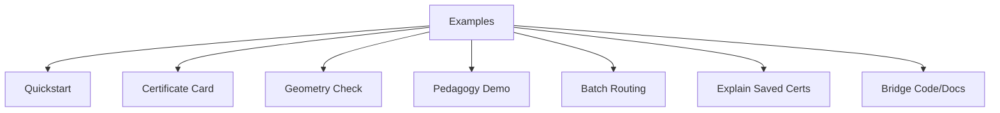

# Examples: Learning by Doing

> Quick-Scan Infobox  
> | Aspect | Details |  
> |--------|---------|  
> | Target User | Engineers verifying components, researchers examining decisions, educators adapting for lessons; basic Python and terminal use assumed. |  
> | Core Goal | Provide complete, runnable scripts that demonstrate routing, inspection, and adjustment, with outputs that reveal system reasoning. |  
> | Time to First Insight | 10 minutes: install, run one script, review the certificate. |  
> | Key Analogy | A set of prepared materials: each script invites direct use, shows immediate results, and supports repeated trials for clearer understanding. |  
> | Known Limitation | Scripts use synthetic or sample data; real prompts may need config tweaks for optimal signals. |

---

## The Prepared Environment

Effective learning starts with materials that are ready and self-correcting. These examples follow that approach: Each one runs independently, produces observable outputs, and includes checks for common issues. Use them to trace a route, inspect a decision, or test a concept, then adjust based on what the signals show.

This structure draws from established methods where feedback comes from the activity itself, allowing steady progress without external prompts.

---

## Installation: Setting Up Your Space

Set up a virtual environment to isolate dependencies.

Expected Output:
```
Successfully installed compitum-0.1.0 ... (list of packages)
```

On Windows (PowerShell): Replace `source .venv/bin/activate` with `.venv\Scripts\Activate.ps1`.

Verify: `compitum --version` should show the installed version, such as "0.1.0".

Limitation: Requires Python 3.9+; if pip fails, update with `pip install --upgrade pip`.

---

## Example Categories

Examples Overview


Caption: Example categories with a single index node. Alt text: Nodes for Quickstart, Card, Geometry, Pedagogy, Batch, Explain, Bridge.

---

## Examples Tour Notebook (optional)

<!-- NOTEBOOK:examples_tour:BEGIN -->
<details><summary>Examples Tour (rendered)</summary>

[Open on GitHub](https://github.com/PaulTiffany/compitum/blob/main/notebooks/Examples_Tour.ipynb) | [Open in nbviewer](https://nbviewer.org/github/PaulTiffany/compitum/blob/main/notebooks/Examples_Tour.ipynb) | [Launch in Binder](https://mybinder.org/v2/gh/PaulTiffany/compitum/main?labpath=notebooks/Examples_Tour.ipynb)

This notebook accompanies the wiki Examples page with a safe, CI-friendly tour.
It verifies imports and points to runnable scripts under `examples/`.


```python
import compitum
print('Compitum version:', getattr(compitum, '__version__', 'unknown'))
print('Modules:', sorted(compitum.__all__))

```

    Compitum version: 0.1.1
    Modules: ['boundary', 'coherence', 'constraints', 'control', 'energy', 'metric', 'router']


## Scripts you can run locally

- examples/: curated examples that exercise router components.
- Use `pip install -e .` in your venv before running.


</details>
<!-- NOTEBOOK:examples_tour:END -->

---

### Quickstart: Your First Route

<!-- NOTEBOOK:examples_demo_route:BEGIN -->
<details><summary>Example: demo_route (rendered)</summary>

[Open on GitHub](https://github.com/PaulTiffany/compitum/blob/main/notebooks/examples/demo_route.ipynb) | [Open in nbviewer](https://nbviewer.org/github/PaulTiffany/compitum/blob/main/notebooks/examples/demo_route.ipynb) | [Launch in Binder](https://mybinder.org/v2/gh/PaulTiffany/compitum/main?labpath=notebooks/examples/demo_route.ipynb)

```python
from __future__ import annotations

import argparse
import sys
from subprocess import run


def main() -> int:
    parser = argparse.ArgumentParser(
        description="Run a one-line compitum CLI routing demo."
    )
    parser.add_argument(
        "--prompt",
        default="Prove that the harmonic series diverges.",
        help="Prompt to route.",
    )
    parser.add_argument(
        "--trace",
        action="store_true",
        help="Show full certificate (pass --trace to CLI).",
    )
    parser.add_argument(
        "--seed",
        type=int,
        default=12345,
        help="Seed forwarded to CLI for deterministic synthetic fit.",
    )
    args = parser.parse_args()

    cmd = [
        sys.executable,
        "-m",
        "compitum.cli",
        "route",
        "--prompt",
        args.prompt,
        "--seed",
        str(args.seed),
    ]
    if args.trace:
        cmd.append("--trace")
    run(cmd, check=True)
    return 0


if __name__ == "__main__":
    raise SystemExit(main())

```


</details>
<!-- NOTEBOOK:examples_demo_route:END -->

Script: `examples/demo_route.py`  
Time: 30 seconds  
Concept: Full routing process, from prompt to certificate.

Run this to process a prompt and view the decision.

Expected Output:
```
Selected: thinking (utility=0.82)
```

This output provides direct feedback: check slack values for feasibility, shadow prices for constraint impacts, and entropy for decision confidence. If entropy is low (<1.0), the choice was narrow; consider relaxing bounds.

#### Interpreting the Output (Quickstart)
- Utility: values around 0.7-0.9 typically indicate a confident choice; <0.6 suggests constraints are tight or the prompt is off-manifold.
- Boundary gap: >0.15 indicates clear separation between models; <0.05 suggests ambiguity.
- Shadow prices: near 0 means constraints are not binding; >0.5 means the constraint is limiting utility.
- Drift signal: negative and small magnitude indicates stability across iterations.
- Investigate when: low utility despite feasibility; multiple high shadow prices; ambiguous boundary.

---

### Certificate Cards: Human-Readable Summaries

<!-- NOTEBOOK:examples_certificate_card:BEGIN -->
<details><summary>Example: certificate_card (rendered)</summary>

[Open on GitHub](https://github.com/PaulTiffany/compitum/blob/main/notebooks/examples/certificate_card.ipynb) | [Open in nbviewer](https://nbviewer.org/github/PaulTiffany/compitum/blob/main/notebooks/examples/certificate_card.ipynb) | [Launch in Binder](https://mybinder.org/v2/gh/PaulTiffany/compitum/main?labpath=notebooks/examples/certificate_card.ipynb)

```python
from __future__ import annotations

import argparse
import json
from pathlib import Path
from typing import Any, Dict

import numpy as np

from compitum.cli import _load_constraints, _toy_models  # type: ignore[import]
from compitum.boundary import BoundaryAnalyzer  # type: ignore[import]
from compitum.coherence import CoherenceFunctional  # type: ignore[import]
from compitum.constraints import ReflectiveConstraintSolver  # type: ignore[import]
from compitum.control import LyapunovController  # type: ignore[import]
from compitum.energy import SymbolicFreeEnergy  # type: ignore[import]
from compitum.metric import SymbolicManifoldMetric  # type: ignore[import]
from compitum.pgd import RegexPromptExtractor  # type: ignore[import]
from compitum.router import CompitumRouter  # type: ignore[import]


def build_router(D: int, defaults_path: Path, constraints_path: Path, seed: int) -> CompitumRouter:
    models = _toy_models(D)
    from compitum.predictors import CalibratedPredictor

    rng = np.random.default_rng(seed)
    X = rng.standard_normal((256, D))
    predictors: Dict[str, Dict[str, CalibratedPredictor]] = {}
    for m in models:
        q = rng.random(256)
        t = rng.random(256)
        c = rng.random(256)
        pq = CalibratedPredictor(); pq.fit(X, q)
        pt = CalibratedPredictor(); pt.fit(X, t)
        pc = CalibratedPredictor(); pc.fit(X, c)
        predictors[m.name] = {"quality": pq, "latency": pt, "cost": pc}

    dcfg = json.loads(Path(defaults_path).read_text().replace("'", '"')) if defaults_path.suffix == ".json" else None
    # Fallback: YAML via CLI helper
    if dcfg is None:
        import yaml
        dcfg = yaml.safe_load(Path(defaults_path).read_text())

    A, B = _load_constraints(constraints_path)
    solver = ReflectiveConstraintSolver(A, B)
    met = {m.name: SymbolicManifoldMetric(D, rank=int(dcfg["metric"]["rank"]), delta=float(dcfg["metric"]["delta"])) for m in models}
    coherence = CoherenceFunctional(k=128)
    boundary = BoundaryAnalyzer(
        float(dcfg.get("boundary", {}).get("gap_threshold", 0.05)),
        float(dcfg.get("boundary", {}).get("entropy_threshold", 0.65)),
        float(dcfg.get("boundary", {}).get("sigma_threshold", 0.12)),
    )
    ctrl = LyapunovController()
    energy = SymbolicFreeEnergy(
        dcfg["alpha"], dcfg["beta_t"], dcfg["beta_c"], dcfg["beta_d"], dcfg["beta_s"]
    )
    pgd = RegexPromptExtractor()
    return CompitumRouter(
        models, predictors, solver, coherence, boundary, ctrl, pgd, met, energy, update_stride=int(dcfg["update_stride"])
    )


def render_markdown_card(data: Dict[str, Any]) -> str:
    comps = data.get("utility_components", {})
    comps_sorted = sorted(comps.items(), key=lambda kv: abs(kv[1]), reverse=True)
    lines = []
    lines.append(f"# Certificate Card\n")
    lines.append(f"- Model: `{data.get('model')}`")
    lines.append(f"- Utility: {data.get('utility'):.4f}")
    if comps_sorted:
        lines.append("- Top components:")
        for k, v in comps_sorted[:3]:
            lines.append(f"  - {k}: {v:+.4f}")
    b = data.get("boundary", {})
    if b:
        gap = b.get("utility_gap"); ent = b.get("entropy"); amb = b.get("is_boundary")
        lines.append(f"- Boundary: gap={gap:.4f} entropy={ent:.4f} ambiguous={amb}")
    c = data.get("constraints", {})
    if c:
        lines.append(f"- Feasible: {c.get('feasible')}")
        if "shadow_prices" in c:
            try:
                nz = sum(1 for x in c["shadow_prices"] if abs(float(x)) > 1e-9)
                lines.append(f"- Shadow prices: {nz} non-zero")
            except Exception:
                pass
    d = data.get("drift", {})
    if d:
        tr = d.get("trust_radius")
        lines.append(f"- Trust radius: {tr}")
    return "\n".join(lines) + "\n"


def main() -> int:
    ap = argparse.ArgumentParser(description="Route a prompt and print a Markdown certificate card.")
    ap.add_argument("--prompt", required=True, help="Prompt to route")
    ap.add_argument("--defaults", type=Path, default=Path("configs/router_defaults.yaml"))
    ap.add_argument("--constraints", type=Path, default=Path("configs/constraints_us_default.yaml"))
    ap.add_argument("--seed", type=int, default=12345)
    args = ap.parse_args()

    # PGD extractor emits a fixed 35D Riemannian vector; keep D=35 for consistency.
    router = build_router(35, args.defaults, args.constraints, args.seed)
    cert = router.route(args.prompt)
    data = json.loads(cert.to_json())
    print(render_markdown_card(data))
    return 0


if __name__ == "__main__":
    raise SystemExit(main())

```


</details>
<!-- NOTEBOOK:examples_certificate_card:END -->

Script: `examples/certificate_card.py`  
Time: 1 minute  
Concept: Format certificate details for quick review.

Expected Output (example):
```markdown
# Certificate Summary
- Model: thinking
- Utility: 0.8234
- Components:
  - quality: +0.65
  - coherence: +0.12
  - diversity: +0.92
- Boundary: gap=0.15 entropy=1.42 (confident)
- Feasible: True
- Shadow prices: latency=0.08 cost=0.12 (low impact)
- Trust radius: 1.2
```

This view highlights key signals: positive coherence shows alignment with prior traces; low shadow prices indicate room for adjustments. Use it to discuss decisions without parsing JSON.

Limitation: Assumes a single certificate; for batches, chain with batch scripts.

#### Interpreting the Output (Certificate Card)
- Utility magnitude: 0.5-0.9 is typical; sustained <0.6 suggests either tight bounds or metric miscalibration.
- Boundary gap and entropy: gap>0.15 with moderate entropy implies a clear decision; small gap with high entropy implies uncertainty.
- Shadow prices: focus on the largest components; values >0.5 identify the strongest bottlenecks.
- When to dig deeper: ambiguous boundary, multiple high shadow prices, or low utility with feasibility.

---

### Geometry Sanity Check: Does Distance Mean Anything?

<!-- NOTEBOOK:examples_synth_bench:BEGIN -->
<details><summary>Example: synth_bench (rendered)</summary>

[Open on GitHub](https://github.com/PaulTiffany/compitum/blob/main/notebooks/examples/synth_bench.ipynb) | [Open in nbviewer](https://nbviewer.org/github/PaulTiffany/compitum/blob/main/notebooks/examples/synth_bench.ipynb) | [Launch in Binder](https://mybinder.org/v2/gh/PaulTiffany/compitum/main?labpath=notebooks/examples/synth_bench.ipynb)

```python
from __future__ import annotations

import argparse
import json
import numpy as np

from compitum.metric import SymbolicManifoldMetric  # type: ignore[import]


def main() -> int:
    p = argparse.ArgumentParser(description="Synthetic SPD metric sanity check.")
    p.add_argument("--D", type=int, default=35, help="Embedding dimension")
    p.add_argument("--rank", type=int, default=8, help="Low-rank factor for SPD metric")
    p.add_argument("--n", type=int, default=500, help="Samples per cluster")
    p.add_argument("--seed", type=int, default=0, help="Random seed")
    p.add_argument("--quiet", action="store_true", help="Print only the JSON result")
    args = p.parse_args()

    rng = np.random.default_rng(args.seed)
    D = int(args.D)
    M = SymbolicManifoldMetric(D, min(args.rank, D))
    # Two clusters: math-like vs code-like
    math_center = rng.normal(0, 1, size=D)
    code_center = rng.normal(0, 1, size=D)
    code_center[:5] += 2.0
    X_math = rng.normal(0, 0.6, size=(args.n, D)) + math_center
    X_code = rng.normal(0, 0.6, size=(args.n, D)) + code_center
    dm = float(np.mean([M.distance(x, math_center)[0] for x in X_math]))
    dc = float(np.mean([M.distance(x, code_center)[0] for x in X_code]))
    result = {"avg_d_math": dm, "avg_d_code": dc, "D": D, "rank": int(min(args.rank, D))}
    if not args.quiet:
        print("Synthetic SPD sanity check (two clusters)")
        print(f"Seed={args.seed} D={D} rank={result['rank']} n={args.n}")
    print(json.dumps(result))
    return 0


if __name__ == "__main__":
    raise SystemExit(main())

```


</details>
<!-- NOTEBOOK:examples_synth_bench:END -->

Script: `examples/synth_bench.py`  
Time: 2 minutes  
Concept: Test if the SPD metric distinguishes prompt types.

Expected Output: differences >0.5 suggest separation; rerun with `--seed 42` for consistency.

This measures average distances in synthetic clusters (math vs. code prompts). If gaps are small, the metric may need retraining; check rank parameter.

#### Interpreting the Output (Geometry)
- Mean distances: larger separation between clusters (e.g., >0.5) indicates the SPD metric distinguishes prompt families.
- Sensitivity: if separation is small, adjust metric rank or retrain; fix seeds for reproducibility when comparing runs.
- Expect minor variance run-to-run; large swings suggest insufficient samples.

---

### Pedagogy Demo: Practice Improves Evidence

<!-- NOTEBOOK:examples_pedagogy_control_of_error:BEGIN -->
<details><summary>Example: pedagogy_control_of_error (rendered)</summary>

[Open on GitHub](https://github.com/PaulTiffany/compitum/blob/main/notebooks/examples/pedagogy_control_of_error.ipynb) | [Open in nbviewer](https://nbviewer.org/github/PaulTiffany/compitum/blob/main/notebooks/examples/pedagogy_control_of_error.ipynb) | [Launch in Binder](https://mybinder.org/v2/gh/PaulTiffany/compitum/main?labpath=notebooks/examples/pedagogy_control_of_error.ipynb)

```python
"""
Pedagogy demo: Control of Error via practice (coherence) and prepared environment.

Runs a simple route, simulates "practice" by updating the coherence reservoir
near the winner's whitened vector, then re-routes and prints evidence/utility deltas.
No core code changes required.
"""
from __future__ import annotations

import json
from pathlib import Path

import numpy as np
import yaml

from compitum.boundary import BoundaryAnalyzer
from compitum.capabilities import Capabilities
from compitum.coherence import CoherenceFunctional
from compitum.constraints import ReflectiveConstraintSolver
from compitum.control import LyapunovController
from compitum.energy import SymbolicFreeEnergy
from compitum.metric import SymbolicManifoldMetric
from compitum.models import Model
from compitum.pgd import RegexPromptExtractor
from compitum.predictors import CalibratedPredictor
from compitum.router import CompitumRouter


def build_demo_router() -> CompitumRouter:
    defaults = yaml.safe_load(Path("configs/router_defaults.yaml").read_text())
    D = int(defaults["metric"]["D"])
    rank = int(defaults["metric"]["rank"])
    delta = float(defaults["metric"]["delta"])

    rng = np.random.default_rng(7)
    centers = {
        "fast": rng.normal(0.0, 0.4, size=D),
        "thinking": rng.normal(0.0, 1.0, size=D),
        "auto": rng.normal(0.1, 0.7, size=D),
    }
    costs = {"fast": 0.1, "thinking": 0.5, "auto": 0.2}
    caps = Capabilities(regions={"US", "CA", "EU"}, tools_allowed={"none"})
    models = [Model(name=k, center=v, capabilities=caps, cost=costs[k]) for k, v in centers.items()]

    # lightweight predictors for demo
    X = rng.standard_normal((256, D))
    predictors = {}
    for m in models:
        q = 0.6 + 0.1 * np.tanh(X @ (m.center / (np.linalg.norm(m.center) + 1e-8)))
        t = 0.5 + 0.5 * np.abs(X @ np.ones(D) / np.sqrt(D))
        c = 0.2 + 0.4 * np.abs(X @ (np.arange(D) / D))
        pq = CalibratedPredictor(); pq.fit(X, q)
        pt = CalibratedPredictor(); pt.fit(X, t)
        pc = CalibratedPredictor(); pc.fit(X, c)
        predictors[m.name] = {"quality": pq, "latency": pt, "cost": pc}

    metrics = {m.name: SymbolicManifoldMetric(D, rank, delta) for m in models}
    coherence = CoherenceFunctional(k=512)
    A, b = yaml.safe_load(Path("configs/constraints_us_default.yaml").read_text()).values()
    solver = ReflectiveConstraintSolver(np.array(A, float), np.array(b, float))
    boundary = BoundaryAnalyzer(gap_threshold=0.05, entropy_threshold=0.65, sigma_threshold=0.12)
    controller = LyapunovController()
    energy = SymbolicFreeEnergy(defaults["alpha"], defaults["beta_t"], defaults["beta_c"], defaults["beta_d"], defaults["beta_s"])
    pgd = RegexPromptExtractor()
    return CompitumRouter(models, predictors, solver, coherence, boundary, controller, pgd, metrics, energy, update_stride=999, enable_metric_update=False, enable_controller=False)


def explain(cert_json: str) -> None:
    data = json.loads(cert_json)
    comps = data.get("utility_components", {})
    print("Decision:", data.get("model"), f"Utility={data.get('utility')}")
    print("Components: distance=", -float(comps.get("distance", 0.0)), "evidence=", comps.get("evidence", 0.0))
    print("Constraints:", data.get("constraints", {}))
    print("Boundary:", data.get("boundary", {}))


def main() -> None:
    router = build_demo_router()
    D = next(iter(router.metric_map.values())).D
    emb = np.zeros(D, dtype=np.float32)

    print("\nBefore practice:")
    cert0 = router.route("Prove AM-GM.", embedding=emb).to_json()
    explain(cert0)
    u0 = json.loads(cert0)["utility"]
    ev0 = json.loads(cert0)["utility_components"]["evidence"]
    winner = json.loads(cert0)["model"]

    print("\nSimulating practice near the winner in whitened space...")
    met = router.metric_map[winner]
    W = met.W if met.W is not None else met._update_cholesky()
    xw = W @ (emb - router.models[winner].center)
    rng = np.random.default_rng(0)
    for _ in range(200):
        noise = rng.normal(0.0, 0.05, size=xw.shape)
        router.coherence.update(winner, xw + noise, success=1.0)

    print("\nAfter practice:")
    cert1 = router.route("Prove AM-GM.", embedding=emb).to_json()
    explain(cert1)
    u1 = json.loads(cert1)["utility"]
    ev1 = json.loads(cert1)["utility_components"]["evidence"]
    print(f"\nDeltas: Δevidence={ev1 - ev0:+.4f}, Δutility={u1 - u0:+.4f}")

    print("\nPrepared environment (region=US -> JP -> US):")
    cUS = router.route("any", context={"region": "US"}, embedding=emb)
    cJP = router.route("any", context={"region": "JP"}, embedding=emb)
    print("US feasible:", json.loads(cUS.to_json())["constraints"]["feasible"], ", JP feasible:", json.loads(cJP.to_json())["constraints"]["feasible"])


if __name__ == "__main__":
    main()


```


</details>
<!-- NOTEBOOK:examples_pedagogy_control_of_error:END -->

Script: `examples/pedagogy_control_of_error.py`  
Time: 3 minutes  
Concept: Show how repeated use strengthens coherence.

Expected Output (example):
```
Before practice:
Decision: thinking  Utility=0.72
Components: distance=-0.15  coherence=0.08
After practice:
Decision: thinking  Utility=0.79
Components: distance=-0.15  coherence=0.21
Changes: Delta(coherence)=+0.13, Delta(utility)=+0.07
```

The script routes once, simulates 200 nearby runs (building trace history), then routes again. Coherence rises as the system recognizes patterns from practice.

It also tests constraints: a US-region prompt succeeds; a JP-region one fails, showing slack=-0.05 and shadow price=0.45 for location bound.

This demonstrates bounded improvement: signals guide refinement without unbounded search.

Montessori parallel: as with cylinder blocks, initial mismatches (low coherence) prompt adjustments; success in similar tasks builds reliable form recognition, fostering independence.

#### Interpreting the Output (Pedagogy)
- Coherence: should increase with practice; rising coherence indicates the router recognizes recurrent structure in nearby prompts.
- Distance component: relatively stable; large changes suggest prompts moved off the trained manifold.
- Constraint slack: negative slack pinpoints the limiting bound; pair with shadow prices to decide whether to relax or collect more data.
- When to investigate: coherence stagnant after many trials, repeated negative slack on the same constraint, or drift increasing across iterations.

---

### Batch Routing: Process Multiple Queries Efficiently

<!-- NOTEBOOK:examples_batch_route_demo:BEGIN -->
<details><summary>Example: batch_route_demo (rendered)</summary>

[Open on GitHub](https://github.com/PaulTiffany/compitum/blob/main/notebooks/examples/batch_route_demo.ipynb) | [Open in nbviewer](https://nbviewer.org/github/PaulTiffany/compitum/blob/main/notebooks/examples/batch_route_demo.ipynb) | [Launch in Binder](https://mybinder.org/v2/gh/PaulTiffany/compitum/main?labpath=notebooks/examples/batch_route_demo.ipynb)

```python
from __future__ import annotations

import argparse
import json
import numpy as np
from pathlib import Path
from typing import Any, Dict, List

from compitum.cli import _load_constraints, _toy_models  # type: ignore[import]
from compitum.boundary import BoundaryAnalyzer  # type: ignore[import]
from compitum.coherence import CoherenceFunctional  # type: ignore[import]
from compitum.constraints import ReflectiveConstraintSolver  # type: ignore[import]
from compitum.control import LyapunovController  # type: ignore[import]
from compitum.energy import SymbolicFreeEnergy  # type: ignore[import]
from compitum.metric import SymbolicManifoldMetric  # type: ignore[import]
from compitum.pgd import RegexPromptExtractor  # type: ignore[import]
from compitum.router import CompitumRouter  # type: ignore[import]


def build_router(D: int, defaults_path: Path, constraints_path: Path, seed: int) -> CompitumRouter:
    models = _toy_models(D)
    from compitum.predictors import CalibratedPredictor

    rng = np.random.default_rng(seed)
    X = rng.standard_normal((128, D))
    predictors: Dict[str, Dict[str, CalibratedPredictor]] = {}
    for m in models:
        q = rng.random(128)
        t = rng.random(128)
        c = rng.random(128)
        pq = CalibratedPredictor(); pq.fit(X, q)
        pt = CalibratedPredictor(); pt.fit(X, t)
        pc = CalibratedPredictor(); pc.fit(X, c)
        predictors[m.name] = {"quality": pq, "latency": pt, "cost": pc}

    import yaml

    dcfg = yaml.safe_load(Path(defaults_path).read_text())
    A, B = _load_constraints(constraints_path)
    solver = ReflectiveConstraintSolver(A, B)
    met = {m.name: SymbolicManifoldMetric(D, rank=int(dcfg["metric"]["rank"]), delta=float(dcfg["metric"]["delta"])) for m in models}
    coherence = CoherenceFunctional(k=64)
    boundary = BoundaryAnalyzer(
        float(dcfg.get("boundary", {}).get("gap_threshold", 0.05)),
        float(dcfg.get("boundary", {}).get("entropy_threshold", 0.65)),
        float(dcfg.get("boundary", {}).get("sigma_threshold", 0.12)),
    )
    ctrl = LyapunovController()
    energy = SymbolicFreeEnergy(
        dcfg["alpha"], dcfg["beta_t"], dcfg["beta_c"], dcfg["beta_d"], dcfg["beta_s"]
    )
    pgd = RegexPromptExtractor()
    return CompitumRouter(
        models, predictors, solver, coherence, boundary, ctrl, pgd, met, energy, update_stride=int(dcfg["update_stride"])
    )


def main() -> int:
    ap = argparse.ArgumentParser(description="Batch routing demo with tiny embeddings.")
    ap.add_argument("--D", type=int, default=35)
    ap.add_argument("--n", type=int, default=3, help="Batch size")
    ap.add_argument("--seed", type=int, default=7)
    ap.add_argument("--defaults", type=Path, default=Path("configs/router_defaults.yaml"))
    ap.add_argument("--constraints", type=Path, default=Path("configs/constraints_us_default.yaml"))
    args = ap.parse_args()

    router = build_router(args.D, args.defaults, args.constraints, args.seed)
    rng = np.random.default_rng(args.seed)
    X = rng.standard_normal((args.n, args.D)).astype(np.float32)
    certs = router.batch_route(X)
    out: List[Dict[str, Any]] = []
    for c in certs:
        d = json.loads(c.to_json())
        out.append({
            "model": d.get("model"),
            "utility": d.get("utility"),
            "boundary_gap": d.get("boundary", {}).get("utility_gap"),
            "feasible": d.get("constraints", {}).get("feasible"),
        })
    print(json.dumps({"n": len(out), "samples": out}))
    return 0


if __name__ == "__main__":
    raise SystemExit(main())

```


</details>
<!-- NOTEBOOK:examples_batch_route_demo:END -->

Script: `examples/batch_route_demo.py`  
Time: 1 minute  
Concept: Handle groups of prompts at once.

Use for logs or benchmarks. Outputs list decisions; aggregate utilities to spot trends (e.g., average gap <0.1 indicates stable choices).

#### Interpreting the Output (Batch)
- Aggregates: track mean/median utility and boundary gap; narrow gaps and low utility across the batch suggest overly tight global bounds.
- Spread: large variance across prompts indicates heterogeneous difficulty; segment by prompt family to diagnose.
- Throughput vs stability: if timing improves but drift grows, consider larger trust regions or refreshed metric calibration.
- Actionables: focus on prompts with high shadow prices; they identify constraints that most reduce utility.

---

### Explain Saved Certificates

<!-- NOTEBOOK:examples_explain_certificate_file:BEGIN -->
<details><summary>Example: explain_certificate_file (rendered)</summary>

[Open on GitHub](https://github.com/PaulTiffany/compitum/blob/main/notebooks/examples/explain_certificate_file.ipynb) | [Open in nbviewer](https://nbviewer.org/github/PaulTiffany/compitum/blob/main/notebooks/examples/explain_certificate_file.ipynb) | [Launch in Binder](https://mybinder.org/v2/gh/PaulTiffany/compitum/main?labpath=notebooks/examples/explain_certificate_file.ipynb)

```python
from __future__ import annotations

import argparse
import json
from pathlib import Path

from examples.certificate_card import render_markdown_card  # reuse


def main() -> int:
    ap = argparse.ArgumentParser(description="Explain an existing certificate JSON as a Markdown card.")
    ap.add_argument("--input", type=Path, required=True, help="Path to certificate JSON or JSONL (uses first line)")
    args = ap.parse_args()

    p = args.input
    text = p.read_text(encoding="utf-8")
    if p.suffix.lower() == ".jsonl":
        line = text.splitlines()[0]
        data = json.loads(line)
    else:
        data = json.loads(text)
    print(render_markdown_card(data))
    return 0


if __name__ == "__main__":
    raise SystemExit(main())


```


</details>
<!-- NOTEBOOK:examples_explain_certificate_file:END -->

Script: `examples/explain_certificate_file.py`  
Time: 30 seconds  
Concept: Review stored JSON/JSONL files.

Expected Output: Markdown cards for each entry, like the single-card example above.

#### Interpreting the Output (Explain)
- Repeated bottlenecks: constraints with high shadow prices across many certificates warrant policy or bound review.
- Ambiguity: clusters of small boundary gaps flag decision uncertainty; consider additional data or temperature adjustments.
- Trend lines: track utility and drift over time; monotone improvements signal effective iteration, regressions suggest configuration drift.
- Triage: sort by (feasible=False) first, then by max shadow price, then by lowest utility.

---

### Bridge Demo: Code-Documentation Sync

<!-- NOTEBOOK:examples_bridge_demo:BEGIN -->
<details><summary>Example: bridge_demo (rendered)</summary>

[Open on GitHub](https://github.com/PaulTiffany/compitum/blob/main/notebooks/examples/bridge_demo.ipynb) | [Open in nbviewer](https://nbviewer.org/github/PaulTiffany/compitum/blob/main/notebooks/examples/bridge_demo.ipynb) | [Launch in Binder](https://mybinder.org/v2/gh/PaulTiffany/compitum/main?labpath=notebooks/examples/bridge_demo.ipynb)

```python
# Demo file for the Python-LaTeX bridge.


def calculate_gravity(mass1, mass2, distance):
    """A simple function to demonstrate the bridge."""
    # BRIDGEBLOCK_START demo-concept-1
    G = 6.67430e-11  # Gravitational constant
    force = (G * mass1 * mass2) / (distance**2)
    return force
    # BRIDGEBLOCK_END demo-concept-1


if __name__ == "__main__":
    f = calculate_gravity(100, 200, 10)
    print(f"Calculated force: {f}")

```


</details>
<!-- NOTEBOOK:examples_bridge_demo:END -->

Files: `examples/bridge_demo.py`, `examples/bridge_demo.tex`  
Time: 2 minutes  
Concept: Ensure code aligns with documentation.

Run `python examples/bridge_demo.py` to extract spans and compare with LaTeX. Outputs confirm matches, e.g., "BRIDGEBLOCK router_init: 12 lines synced."

This internal check maintains consistency; useful for auditing changes.

#### Interpreting the Output (Bridge)
- Match counts: larger matched spans imply documentation and code are aligned; missing or short matches indicate stale docs.
- Drift in spans: frequent changes to the same region suggest unstable interfaces; consider refactoring or codifying examples.
- Use in reviews: treat mismatches as actionable diffs between intended behavior (docs) and implementation.

---

## Troubleshooting

- CLI not found: verify virtual environment is active and `pip install -e .` succeeded.
- Import errors: reinstall in a clean environment; confirm Python 3.9+.
- Determinism: set seeds where applicable; minor variance is expected but drift should be stable.
- Performance timing: stable timings; adjust for parallel overhead.

Limitation: environment variables may not persist; set per session.

---

## Design Patterns in These Examples

1. Complete scripts: each runs end-to-end, no partial code.  
2. Interpretable outputs: JSON for parsing, Markdown for review.  
3. Visible errors: failures show specific signals (e.g., slack <0).  
4. Cumulative improvement: demos build on traces, showing signal changes.

These patterns ensure feedback guides use: Adjust based on what is observed, then retry.

---

## What These Examples Teach Beyond Code

- Educators: outputs reveal reasoning layers; use cards to discuss "why this model?" with students.  
- Engineers: scripts expose controls like trust radius; tweak and measure drift to tune stability.  
- Researchers: self-supervised checks (coherence, gaps) enable label-free evaluation; extend with your data.

In each case, the materials provide their own checks: run, observe, refine. This meets the user halfway, offering structure while inviting adaptation.

---

## Next Steps

- Run the quickstart: process a prompt in 30 seconds.  
- Execute the pedagogy demo: track coherence gains from practice.  
- Generate a certificate card: summarize a decision.  
- Review Mathematics pages: details on metrics and stability.  
- Extend in Getting Started: customize for your workflow.  

---

## A Note on Reproducibility

Scripts accept `--seed` for fixed results. This supports repeated trials: consistent outputs build understanding, much like verifying a measurement multiple times.

*Last tuned: November 08, 2025 - Compitum v1.0+ - Open to contributions*

