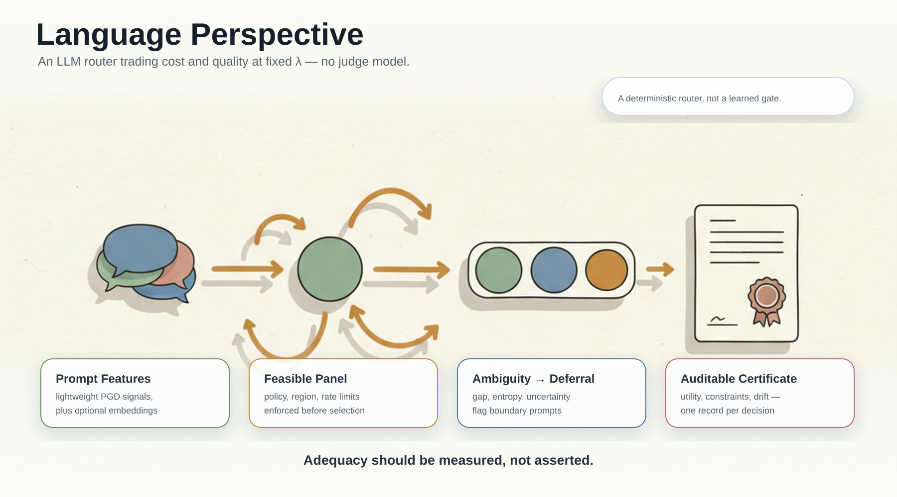

# Language Perspective (cs.CL)

This page frames Compitum for cs.CL reviewers: an NLP router for LLM tasks that trades cost and quality at fixed willingness-to-pay (lambda), enforces policy/region constraints, detects ambiguity, and emits an auditable certificate per decision — all without a judge model.

> Related: [cs.LG](Learning-Perspective.md) · [cs.SY](Control-Perspective.md) · [stat.ML](Statistical-Notes.md) · [SRMF ⇄ Lyapunov](SRMF-as-Lyapunov.md) · [Peer Review Protocol](PEER_REVIEW.md) · [Certificate Schema](Certificate-Schema.md)



## Problem in NLP Terms

- Inputs: prompts and light-weight prompt-derived features (PGD), plus optional embeddings.
- Models: a small set of LLM backends (fast, thinking, auto) with different quality/cost/latency profiles.
- Objective: maximize utility U = quality − lambda * total_cost at fixed lambda, subject to constraints (e.g., region/policy/rate).
- Decision: route each prompt to the best feasible model; optionally defer when ambiguity is high (boundary region).

Code anchors: src/compitum/router.py:80 (route), src/compitum/constraints.py:36 (feasibility), src/compitum/energy.py:33 (utility), src/compitum/boundary.py:19 (ambiguity), src/compitum/router.py:25 (certificate schema).

## What We Emit (Certificate)

Per decision, a certificate exposes:
- utility components (quality, latency, cost), overall utility U
- constraints (feasible, approximate local shadow prices)
- boundary diagnostics (gap to runner-up, entropy, uncertainty)
- drift/trust-region state (for online adaptation)

This makes routing auditable and suitable for post-hoc error analysis and deferral policies.

## Relation to cs.CL Literature

- Mixture-of-Experts and routing: Compitum is a deterministic router across a small panel of LLMs, optimizing a scalarized utility with constraints, not a learned soft gate within a single model.
- Selective prediction/abstention: boundary flags align with deferral; we measure deferral quality against high-regret items.
- Cost-aware evaluation: fixed lambda slices capture cost–quality tradeoffs; we report regret, win rate, and cost deltas (when available).
- Calibration: we use calibrated component predictors and report reliability of uncertainty vs. absolute regret.

## Constraints and Safety

- Policy/rate/region constraints are enforced before selection (feasibility-first); constraint compliance should be ~100%.
- Approximate shadow prices (finite-difference viability) help identify binding constraints; they are diagnostic only.

## Coherence and Ambiguity

- A metric-aware KDE prior (whitened) nudges decisions toward familiar contexts with predictable behavior.
- Boundary diagnostic combines gap, entropy, and uncertainty to flag ambiguous prompts where deferral or conservative routing is prudent.

## Evaluation for cs.CL

- Panel and per-task summaries at fixed lambda (e.g., 0.1 and 1.0):
  - regret and win rate vs best baseline
  - boundary/deferral rate and quality
  - optional cost delta on wins if cost columns are present
- Calibration diagnostics: reliability curve (uncertainty bins) and Spearman rho(uncertainty, |regret|).
- Constraint compliance rate (~100%).

Helper commands:

- cs.CL summary

```bat
python tools\analysis\cl_summary.py ^
  --input data\rb_clean\eval_results\<latest-compitum-csv>.csv ^
  --out-json reports\cl_summary.json ^
  --out-md reports\cl_summary.md
```

- Reliability curve and CEI (see docs/Statistical-Notes.md and docs/Control-of-Error.md)

- Decision curves (ambiguity-based deferral upper bound + boundary AP/AUROC)

```bat
python tools\analysis\cl_decision_curves.py ^
  --input data\rb_clean\eval_results\<latest-compitum-csv>.csv ^
  --quantiles 0,0.05,0.1,0.2,0.3,0.4,0.5 ^
  --out-json reports\cl_decision_curves.json ^
  --out-md reports\cl_decision_curves.md ^
  --out-png reports\cl_decision_curve.png
```

## Reproducibility

- Deterministic evaluation with fixed seeds and offline artifacts.
- Attach reports/cl_summary.md, reliability_curve.md/png, cei_report.md, fixed_wtp_summary.md.

## Determinism & Explainability (0.1.1)

- Determinism
  - Repeated route and batch determinism under fixed seeds/embeddings.
  - Tests: `tests/invariants/test_invariants_router_determinism.py`, `tests/router/test_router_batch_determinism.py`
- Paraphrase robustness
  - Flip budget under small lexical/format edits; flips must be explainable via certificate deltas (distance or feasibility changes).
  - Tests: `tests/invariants/test_paraphrase_invariance.py`, `tests/invariants/test_paraphrase_explainability.py`

## Limits (cs.CL)

- No judge model; utility proxies depend on upstream task scoring and pricing assumptions.
- Shadow prices are approximate diagnostics; coherence prior is bounded and small-weight.
- Router panel size is intentionally small; extending to larger panels is future work.
