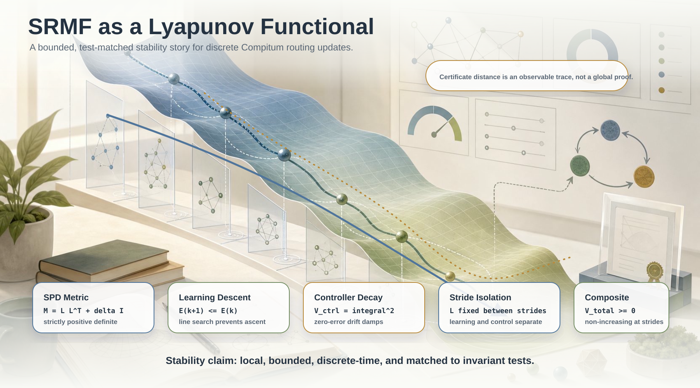

# SRMF as a Lyapunov Functional

This note states the assumptions and lemmas under which Compitum's
self-regulating mapping function (SRMF) behaves as a Lyapunov functional for our
discrete-time routing dynamics.

The claims are matched by property-based tests; file paths are provided for
direct inspection.

## Setting and Assumptions

- Positive-definite metric: The SPD matrix `M = L L^T + delta I` is strictly PD
  for `delta > 0`.
  - Code: `src/compitum/metric.py` (`metric_matrix`), tests:
    `tests/invariants/test_invariants_metric.py`.
- Two-timescale learning: Low-rank factor `L` updates every `update_stride`
  steps via a backtracking line search; controller updates each step.
  - Code: `src/compitum/router.py` (stride guards), tests:
    `tests/invariants/test_invariants_control_sy.py::test_two_timescale_metric_update_stride`.
- Controller update: Drift integral anti-windup and clipping ensure bounded
  trust radius `r in [0.2, 5.0]` and non-increase of
  `V_ctrl = integral^2` when `d_star = 0`.
  - Code: `src/compitum/control.py`, tests:
    `tests/invariants/test_invariants_control_sy.py::test_lyapunov_decays_under_zero_error`.
- Surrogate energy (learning objective): For whitened residual `z = x - mu`,
  define `E(L; z) = 0.5 beta_d ||L^T z||^2`.
  - Descent step with backtracking ensures `E_{k+1} <= E_k`.
  - Code: `src/compitum/metric.py::batch_update_spd`, tests:
    `tests/invariants/test_invariants_lg.py::test_metric_update_line_search_non_increase`.

## Lemma A (Learning Descent)

Given `z != 0` and step size selected by backtracking line search as
implemented, the update to `L` satisfies `E_{k+1} <= E_k`.

Evidence:
`tests/invariants/test_invariants_lg.py::test_metric_update_line_search_non_increase`.

## Lemma B (Zero-Error Lyapunov Decay)

For controller state `(drift_integral, r)`, with `d_star = 0` for `T` steps,
the Lyapunov candidate `V_ctrl = drift_integral^2` is non-increasing.

Evidence:
`tests/invariants/test_invariants_control_sy.py::test_lyapunov_decays_under_zero_error`.

## Lemma C (Two-Timescale Isolation)

Before hitting `update_stride`, `L` remains unchanged; at stride, an update may
occur subject to Lemma A. This isolates controller dynamics from learning
updates between strides.

Evidence:
`tests/invariants/test_invariants_control_sy.py::test_two_timescale_metric_update_stride`.

## Composite Potential and SRMF Link

Define a composite potential along the routed trajectory with fixed model
selection and embedding (no switching):

`V_total(k) = E(L_k; z) + gamma V_ctrl(k)`, with `gamma > 0`.

Under the assumptions above, between successive stride boundaries:

- Controller step: `V_ctrl(k+1) <= V_ctrl(k)` when the observed error proxy
  `d_star` is small (zero in the strict Lemma B); more generally the integral
  term damps drift.
- Learning step at stride: `E(L_{k+1}) <= E(L_k)` by Lemma A.

Hence at the sequence of stride boundaries, `V_total` is non-increasing and
bounded below by 0. In practice, distance in the certificate (the negative of
the `distance` component) acts as an observable of `E`.

Evidence:
`tests/invariants/test_invariants_srmf_lyapunov.py::test_distance_decreases_over_updates`.

## Practical Takeaway

- The free-energy-style SRMF surrogate decreases under our update rules, while
  the controller Lyapunov candidate decreases under zero or small drift. This
  realizes SRMF as a Lyapunov functional for the discrete Compitum updates under
  bounded observer assumptions.
- See also statistical monotonicity and uncertainty properties:
  `tests/invariants/test_invariants_statml.py`.
