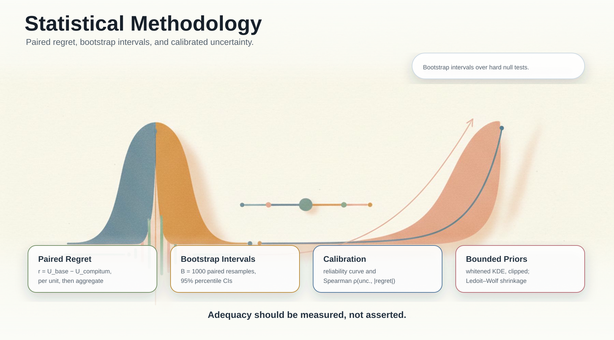

# Statistical Methodology

> Related: [cs.LG](Learning-Perspective.md) · [cs.CL](Language-Perspective.md) · [cs.SY](Control-Perspective.md) · [SRMF ⇄ Lyapunov](SRMF-as-Lyapunov.md) · [Peer Review Protocol](PEER_REVIEW.md) · [Certificate Schema](Certificate-Schema.md)

This page summarizes the statistical modeling choices and evaluation procedures behind Compitum in terms familiar to stat.ML.



## Utility, Regret, and Pairing

- Scalarization: we evaluate decisions via utility U = performance − λ · total_cost at fixed willingness‑to‑pay λ. This induces a paired comparison per evaluation unit.
- Regret: r = U_best_baseline − U_compitum; lower is better. All deltas are computed per unit (paired) before aggregation, reducing variance.
- Slices: headline λ ∈ {0.1, 1.0}; sensitivity grid {1e−4, 1e−3, 1e−2, 0.1, 1.0, 10.0} for frontier plots.

## Uncertainty, Calibration, and Intervals

- Predictive uncertainty: utility variance aggregates calibrated component quantiles (p05, p95) and distance variance; see src/compitum/energy.py:33, src/compitum/metric.py:59.
- Confidence intervals: nonparametric bootstrap (B = 1000 resamples) over evaluation units; 95% percentile CIs. Paired bootstrap preserves dependency structure.
- Calibration diagnostics (recommended to report alongside CEI):
  - Reliability curve: bucket uncertainty into K bins and plot mean |regret| per bin.
  - Rank correlation: Spearman ρ(uncertainty, |regret|) (included in CEI helper).
  - ECE‑style summary (optional): ECE = Σ_b w_b · | E[|regret||b] − t_b | with t_b a monotone target (e.g., rank‑normalized). We avoid over‑interpreting ECE for non‑probabilistic scales; reliability curves are primary.

Helper commands:

```bat
python tools\analysis\reliability_curve.py ^
  --input data\rb_clean\eval_results\<latest-compitum-csv>.csv ^
  --bins 10 ^
  --out-csv reports\reliability_curve.csv ^
  --out-md reports\reliability_curve.md ^
  --out-png reports\reliability_curve.png
```

## KDE Prior and Bandwidth

- Coherence prior: KDE log‑density evaluated in whitened coordinates, with clipping to bound influence; see src/compitum/coherence.py:41.
- Bandwidth: Scott's rule under whitened features yields consistent scaling across dimensions; alternative selectors (Silverman, CV, plug‑in) can be substituted. We report robustness to modest changes of β_s (prior weight) and clipping range.
- Subsampling: an approximate weighted buffer maintains recent whitened residuals; coherence is auxiliary to U and bounded. Sensitivity analysis ensures headline results are robust.

## Metric Learning and Regularization

- Geometry: a low‑rank SPD Mahalanobis metric M = L L^T + δI shapes distances; PD ensured by δ and Cholesky updates; see src/compitum/metric.py:23,39.
- Update: a surrogate gradient step on L with step‑size capped by a trust‑region controller (SRMF), stabilizing online adaptation; see src/compitum/metric.py:106, src/compitum/control.py:15.
- Shrinkage: Ledoit–Wolf shrinkage on whitened residuals reduces variance in dispersion estimates for distance uncertainty.

## Constraints and Shadow Prices

### Duals Evidence (0.1.1)

- Shadow price diagnostics behave as expected: slack~0 when clearly non-binding; boundary>=0; monotone near binding; scale with utility units.
  - Tests: `tests/invariants/test_invariants_constraints_duals.py`, `tests/invariants/test_invariants_duals_near_binding.py`, `tests/invariants/test_invariants_duals_monotone.py`, `tests/invariants/test_invariants_duals_scaling.py`
\r\n- Constraints: linear feasibility Ax_B ≤ b enforced before selection; selection is argmax_U among feasible models; see src/compitum/constraints.py:36.
- Shadow prices: approximate local signals computed via finite‑difference feasibility/viability; reported for auditing; not used to drive selection (i.e., not KKT duals).

## Multiple Comparisons and Pre‑registration

- Multiple baselines are compared via per‑unit best baseline, keeping pairing tight. Frontier plots summarize across λ. We avoid hard null‑hypothesis testing across many tasks and instead report bootstrap CIs and panel averages.
- Evaluation protocol, λ grid, and panel composition are predeclared in docs/PEER_REVIEW.md. Seeds and environment snapshots are saved with artifacts for replicability.

## Sensitivity and Robustness

- β_s (prior weight): conclusions robust to modest sweeps; coherence clipping bounds influence.
- Metric rank: varied within a small range to probe bias–variance; headline conclusions unchanged.
- Update stride/trust‑region: impacts adaptation cadence/throughput, not decision rule correctness.

## Reproducibility

- Determinism: fixed seeds for demos; Hypothesis derandomized in CI.
- Environment: include `pip freeze` and system info with reports.
- Artifacts: fixed‑WTP tables, CEI report, routerbench summary, and manifest with SHA‑256.


